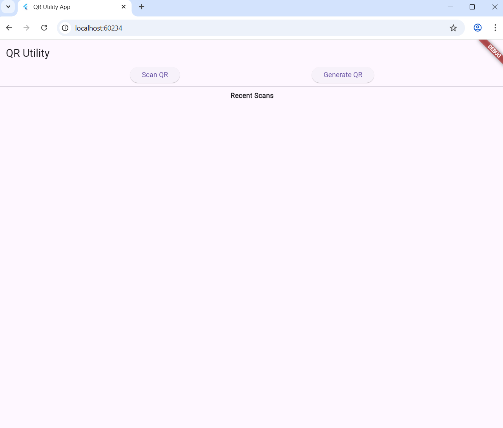
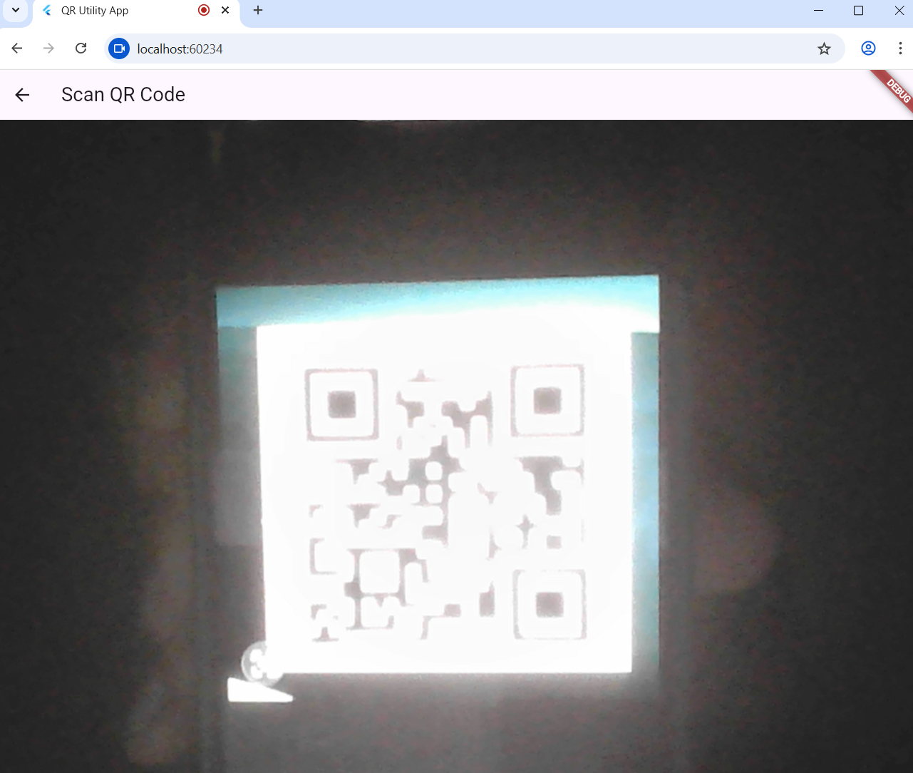
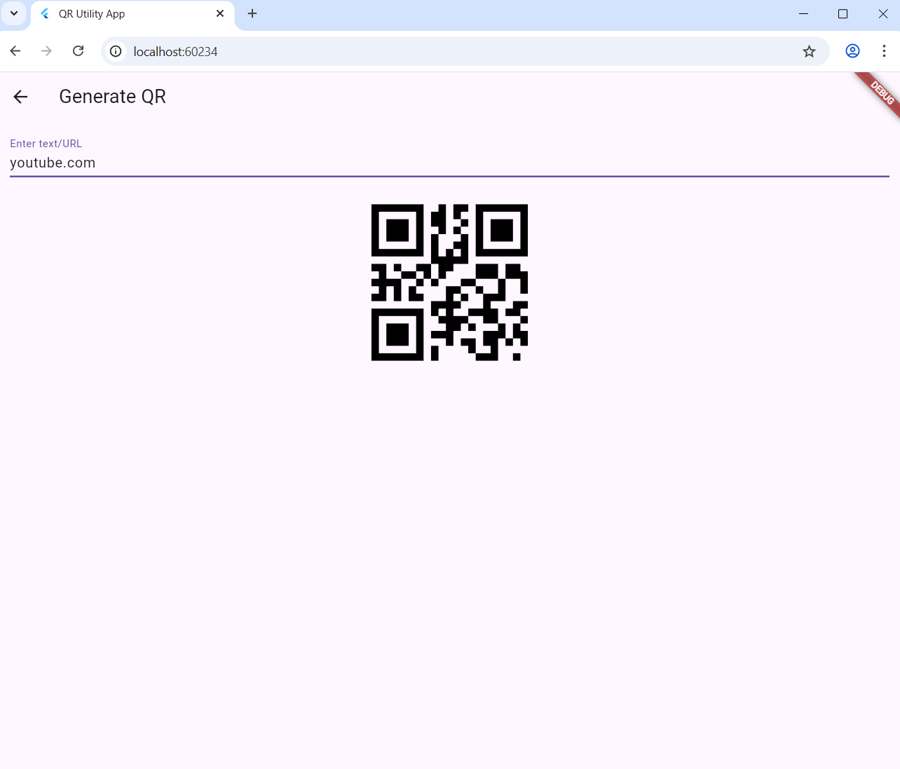

# iOS-club-Task-round
This is my iOS club task round project of a QR code app, made with flutter(dart) language!

## QR Code Utility App
A clean, responsive mobile application built with Flutter that allows users to scan and generate QR codes with local history persistence.

## Features
Core Functionality
Home Dashboard: A clean and organized UI with quick access to scanning and generation tools.
QR Scanner: Real-time scanning using the device camera with automatic content detection.
URL Handling: Automatically identifies URLs and provides an option to open them in a browser.
QR Generator: Create custom QR codes instantly from any text input.

## Bonus Features Implemented
Local Storage: All scanned results are saved locally and persist even after the app restarts.
Recent Scans: A dedicated history section on the dashboard for quick access to previous scans.
Modern UI: Responsive layout designed for a smooth user experience.

## Technologies Used
Language: Dart
Framework: Flutter
Local Persistence: SharedPreferences (Implementation in Corelogic.dart) 
QR Logic: mobile_scanner and qr_flutter

## Project Structure
The project is organized into modular files for better maintainability:
homescreen.dart: The main dashboard and Recent Scans view.
qrscan.dart: Camera-based scanner implementation.
qrgen.dart: Text-to-QR generation interface.
Corelogic.dart: Service layer handling local data storage and history.

## Installation and Setup
Clone the repository:git clone (your-repository-url)
Navigate to the project directory:cd ios-club-task-round
Install dependencies:flutter pub get
Run the application:flutter run

## Design Decisions
Architecture: Chose a service-oriented approach (Corelogic.dart) to separate data handling from the UI, ensuring the code remains clean and testable.
Storage: Used SharedPreferences for the scan history to provide a lightweight and fast user experience without the overhead of a full database setup.

## App Preview

Check out the app in action!

| Home Screen | QR Scanner | QR Generator |
|---|---|---|
|  |  |  |

## Video Demonstration

[Click here to watch the full demo video](assets/qrappdemo.mp4)
